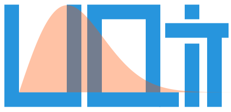

.. UQit documentation master file, created by
   sphinx-quickstart on Wed Aug  5 18:11:47 2020.
   You can adapt this file completely to your liking, but it should at least
   contain the root `toctree` directive.

   
   **A Python Package for Uncertainty Quantification (UQ) in Computational Fluid Dynamics (CFD)**

:code:`UQit` is a Python package for uncertainty quantification (UQ) in computational physics, in general, and in computational fluid dynamics (CFD), in particular.
Different techniques are included to address various types of UQ analyses [Smith13]_, [Ghanem17]_ particularly arising in CFD.
The target CFD problems are in general, three-dimensional, unsteady, and computationally expensive.
These put constraints on the nature of UQ techniques which could be appropriate. 
:code:`UQit` is designed to be non-intrusively linked to any CFD solver through appropriate interfaces. 
Another important design concept in :code:`UQit` is to facilitate adding new techniques upon need and also provide the possibility of combining different UQ tools with each other and also with machine learning and data science techniques which can be easily added to :code:`UQit`.
Some of the main features in the current version of :code:`UQit` are listed below with a general overview and terminology in :ref:`overview-sect`.
Note that for each technique listed below, there is a short theory section followed by implementation details, example and a notebook. 

Dependencies
------------

* Required:  

  - `numpy <https://numpy.org/>`_
  - `scipy <https://www.scipy.org/>`_
  - `matplotlib <https://matplotlib.org/>`_

* Optional:    

  - `cvxpy <https://www.cvxpy.org/>`_ (for PCE)
  - `GPyTorch <https://gpytorch.ai/>`_ (for GPR)
  - `PyTorch <https://pytorch.org/>`_ (for GPR)

Licence
-------
:code:`UQit` is distributed under the terms of this `LICENSE <../../../LICENSE>`_. 

Contact
-------
I would appreciate to hear your comments, ideas, and feedbacks about :code:`UQit`. 
In case there is a bug, please feel free to open an issue on Git. 

.. toctree::
   :maxdepth: 3
   :caption: Contents:

   ./UQit_core_/instl_dep
   ./UQit_core_/codes_list
   ./UQit_core_/terminology
   ./UQit_core_/sampling
   ./UQit_core_/surrogate
   ./UQit_core_/uqFWD
   ./UQit_core_/gsa
   ./UQit_core_/others
   ./UQit_apps_/wrChan
   ./bib

Indices and tables
==================

* :ref:`genindex`
* :ref:`modindex`
* :ref:`search`

